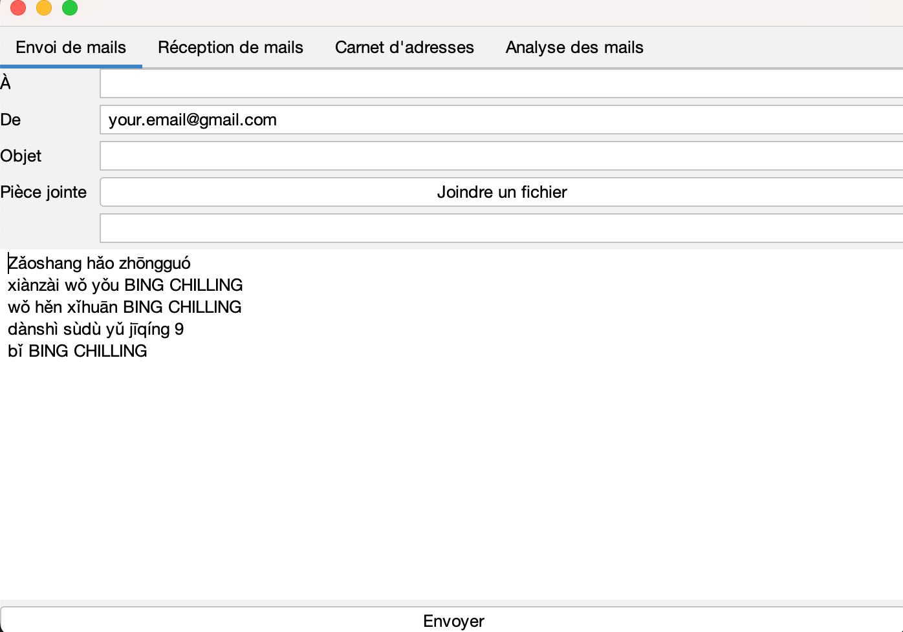

# JavaMail



JavaMail is an app where can send emails through SMTP and retreive emails through IMAP.

#### SDK - Language level
```
Amazon Corretto 20.0.2
21
```

## 📝 - Feedback 

If you have some feedback to send me, contact me via <matteo.arnone@student.hepl.be>.

## 🎓 - Nota Bene

The project has been realized for educational purpose. 
